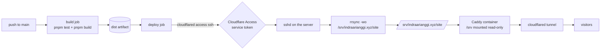

# Deployment

The site is built on a GitHub-hosted runner and pushed to the home server over a Cloudflare Tunnel. The server never accepts inbound connections, and no self-hosted runner is used, so the setup stays safe while `indraarianggi/indraarianggi.xyz` is a public repository.



| File | Role |
|---|---|
| `.github/workflows/deploy.yml` | Build, then rsync the build to the server through the tunnel |
| `deploy/compose.yaml` | Caddy container serving the deployed directory on `127.0.0.1:8080` |
| `deploy/Caddyfile` | Static file serving, cache policy, `404.html` error handling |
| `deploy/cloudflared/config.yml` | Tunnel ingress for the site and the SSH deploy channel |
| `deploy/ssh/authorized_keys.example` | Restricted key entry for the deploy user |

Paths used throughout: site directory `/srv/indraarianggi.xyz/site`, deploy user `deploy`, tunnel hostname `ssh.indraarianggi.xyz`, public origin `https://indraarianggi.xyz`.

## 1. Server packages

Docker with the Compose plugin, OpenSSH server, and rsync (which provides `/usr/bin/rrsync`):

```bash
sudo apt update
sudo apt install -y docker.io docker-compose-v2 openssh-server rsync
sudo systemctl enable --now docker ssh
command -v rrsync      # must print /usr/bin/rrsync
```

On Debian the compose package is `docker-compose-plugin` from Docker's own repository. Any recent Docker Engine with `docker compose` available is fine.

## 2. Cloudflare Tunnel

Run these once, on any machine where you can complete a browser login:

```bash
cloudflared tunnel login                       # authorize the indraarianggi.xyz zone
cloudflared tunnel create indraarianggi        # prints the tunnel UUID
cloudflared tunnel route dns indraarianggi indraarianggi.xyz
cloudflared tunnel route dns indraarianggi ssh.indraarianggi.xyz
```

Install the tunnel on the server:

```bash
sudo install -d -m 0755 /etc/cloudflared
sudo install -m 0644 deploy/cloudflared/config.yml /etc/cloudflared/config.yml
sudo install -m 0600 ~/.cloudflared/<TUNNEL_UUID>.json /etc/cloudflared/credentials.json
sudo sed -i 's/TUNNEL_ID/<TUNNEL_UUID>/' /etc/cloudflared/config.yml

cloudflared --config /etc/cloudflared/config.yml tunnel ingress validate
sudo cloudflared --config /etc/cloudflared/config.yml service install
sudo systemctl enable --now cloudflared
cloudflared tunnel info indraarianggi          # expect two active connections
```

This repository tracks the tunnel as locally managed, so ingress lives in `deploy/cloudflared/config.yml` and is reviewable in git. If you instead create the tunnel from the Zero Trust dashboard, it becomes remotely managed and you run it with a token; this file is then unused and the ingress rules live in the dashboard.

## 3. Cloudflare Access for the deploy channel

The deploy hostname must not accept anonymous SSH, so it sits behind an Access application that only a service token can satisfy.

1. Zero Trust, Access, Service Auth, Service Tokens: create a token named `github-actions-deploy`. Copy the Client ID and Client Secret.
2. Zero Trust, Access, Applications: add a self-hosted application for `ssh.indraarianggi.xyz`.
3. Add one policy: Action `Service Auth`, Include `Service Token` equal to the token from step 1.

Do not create an Access application for `indraarianggi.xyz` itself unless you want the public site gated too.

The service token authenticates the runner to Cloudflare. SSH authentication still happens on top of it, with the key from the next step.

## 4. Deploy user and directory

```bash
sudo useradd --create-home --shell /bin/bash deploy
sudo install -d -m 0755 -o deploy -g deploy /srv/indraarianggi.xyz
sudo install -d -m 0755 -o deploy -g deploy /srv/indraarianggi.xyz/site
sudo install -d -m 0700 -o deploy -g deploy /home/deploy/.ssh
```

Generate the deploy key on your workstation and install its public half with a forced command, so the key can only push files into the site directory:

```bash
ssh-keygen -t ed25519 -C deploy@github-actions -f /tmp/deploy_key -N ''

line="command=\"/usr/bin/rrsync -wo /srv/indraarianggi.xyz/site\",no-agent-forwarding,no-port-forwarding,no-pty,no-user-rc,no-X11-forwarding $(cat /tmp/deploy_key.pub)"
printf '%s\n' "$line" | sudo -u deploy tee /home/deploy/.ssh/authorized_keys
sudo chmod 0600 /home/deploy/.ssh/authorized_keys
```

`DEPLOY_SSH_KEY` is `/tmp/deploy_key`; `DEPLOY_KNOWN_HOSTS` is the server's pinned host key:

```bash
ssh-keyscan -t ed25519 localhost 2>/dev/null | sed 's/^localhost/ssh.indraarianggi.xyz/'
```

Confirm the restriction took effect. This should fail with an rrsync error rather than printing a shell:

```bash
ssh -i /tmp/deploy_key deploy@ssh.indraarianggi.xyz true
```

Leave sshd bound where it is and do not forward port 22 from the router. The tunnel is the only intended path in.

## 5. Start Caddy

Copy `deploy/` to the server, for example `/opt/indraarianggi/`, then:

```bash
cd /opt/indraarianggi
sudo docker compose up -d
curl -sS -o /dev/null -w '%{http_code}\n' http://127.0.0.1:8080/
```

The port returns 404 until the first deploy puts files in `/srv/indraarianggi.xyz/site`. Caddy serves that directory read-only and needs no reload when the files change.

## 6. GitHub configuration

Repository secrets, Settings, Secrets and variables, Actions:

| Secret | Value |
|---|---|
| `DEPLOY_SSH_KEY` | Private key from `ssh-keygen` (full PEM/OpenSSH text, including the header and footer lines) |
| `DEPLOY_KNOWN_HOSTS` | Output of the `ssh-keyscan` command above, one line |
| `CF_ACCESS_CLIENT_ID` | Access service token Client ID |
| `CF_ACCESS_CLIENT_SECRET` | Access service token Client Secret |

Repository variables (optional; the workflow defaults shown apply when unset):

| Variable | Default | Purpose |
|---|---|---|
| `SITE_URL` | `https://indraarianggi.xyz` | Origin baked into canonical URLs, `sitemap-index.xml`, `robots.txt`, and the feed |
| `DEPLOY_HOST` | `ssh.indraarianggi.xyz` | Tunnel hostname routed to sshd |

## 7. Deploy

Push to `main`, or run the workflow manually from the Actions tab. The workflow:

1. Installs with `--frozen-lockfile`, runs `pnpm test`, then `pnpm build`.
2. Fails the job if `dist/` is missing expected files, if the sitemap does not use `SITE_URL`, or if the `.invalid` placeholder origin leaked into the output.
3. Uploads `dist/` as an artifact, then rsyncs it to the restricted directory over the tunnel with `--delete`, so the served tree mirrors the build exactly.
4. Verifies the deployed site: home page 200 with expected content, unknown path 404, and `robots.txt`, `rss.xml`, `sitemap-index.xml`, `favicon.svg` all 200.

Useful commands on the server:

```bash
sudo docker compose logs -f web                     # access and error output
sudo journalctl -u cloudflared -f                   # tunnel status
ls -la /srv/indraarianggi.xyz/site                  # what the last deploy wrote
```

## 8. Rollback

Re-run any earlier successful run from the Actions tab: the build job checks out that run's commit and rebuilds it, so the server ends up serving that revision. Push a revert commit if you would rather fix it forward in history.

Note that `--delete` mirrors the build exactly, so anything placed in `/srv/indraarianggi.xyz/site` by hand is removed by the next deploy. Serve extra files from a different directory or add them to `dist/` in the build.

## Transport constraints

Two details of the deploy step are deliberate, and both were verified against the real `rrsync` script:

- **The destination is `/`, not `/srv/indraarianggi.xyz/site`.** `rrsync` roots the transfer at the restricted directory, so `/` is the site root. Passing the absolute host path makes `rrsync` re-root it *inside* the tree, which nests the build under `.../site/srv/indraarianggi.xyz/site` and fails because directory creation is not permitted.
- **No `--delay-updates`.** The option set is limited to what `rrsync` accepts, and older releases refuse anything else outright with `invalid rsync-command syntax or options`. `--recursive`, `--links`, `--times`, and `--delete` are accepted by every release checked (3.2.7 and 3.4.1); `--delay-updates` is missing from the allowlist in 3.2.3, which ships with Ubuntu 22.04.

Because `--delay-updates` is unavailable, the transfer is a plain mirror rather than an atomic swap. Individual files appear and disappear as they transfer, which is imperceptible for a static personal site. A release-directory symlink scheme would be atomic but needs a remote command, which the write-only restricted key deliberately forbids.

## Operational notes

- **Client IPs.** Caddy runs behind the tunnel, so its access log records the tunnel address. Cloudflare sends the real address in `CF-Connecting-IP`.
- **Host key changes.** If you reinstall the server and its SSH host key changes, the deploy fails closed until `DEPLOY_KNOWN_HOSTS` is updated. That is intended.
- **Artifact retention.** Uploaded artifacts expire after 7 days, which bounds how far back a re-run can redeploy.
- **If the repository becomes private**, a self-hosted runner on the server becomes viable and removes the tunnel step for deploys. Keep it public and use this setup if you want fork PRs to stay harmless.
